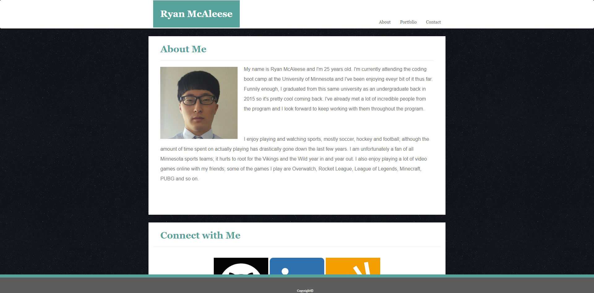
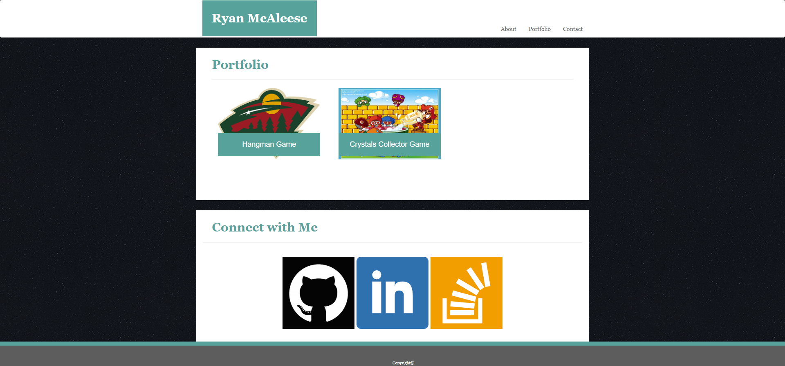
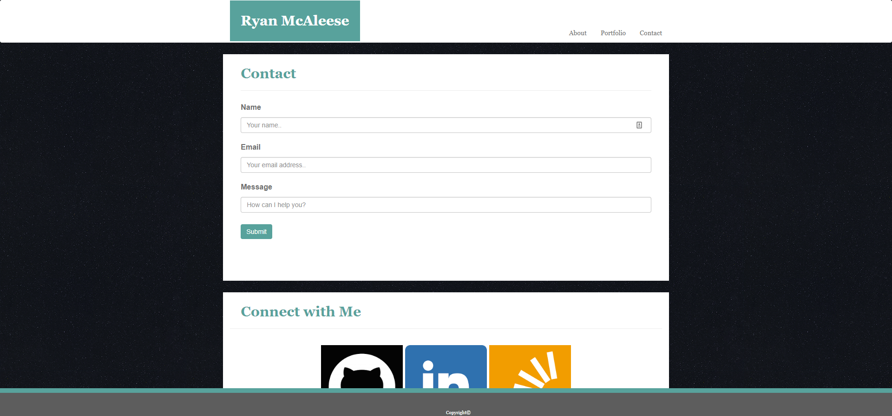

# Assignment 2 Bootstrap Portfolio

This project is similar to Assignment 1 Basic Portfolio but the big difference is that this project uses **Bootstrap** as the front-end framework. Using Bootstrap, the project automatically becomes responsive to different media queries. Click **[here][1]** for live version of the portfolio.

- index.html

- portfolio.html

- contact.html

[1]: https://mcale017.github.io/Assignment-2-Bootstrap-Portfolio/